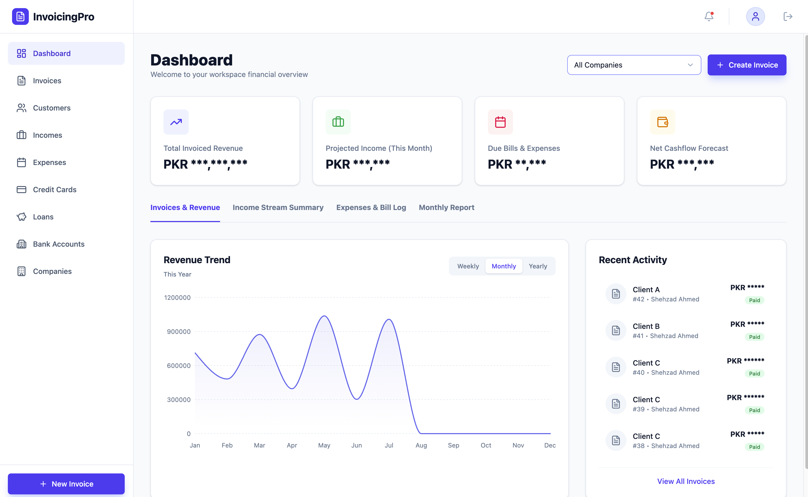

# Budget Pro



## Project Setup

Before running the full application, developers need to set up the environment variables for both the frontend (root) and the backend (`server/`).

1. **Frontend Environment Variables:** 
   Copy the `.env.example` file located in the root directory to a new file named `.env` and fill in any required variables.
   ```bash
   cp .env.example .env
   ```

2. **Backend Environment Variables:**
   Navigate to the `server` directory and copy its `.env.example` file to a new `.env` file. Fill in your actual `MONGO_DB_CONNECTION_URI` and any other secrets.
   ```bash
   cd server
   cp .env.example .env
   ```

## Seed User

If the database is connected properly and the `users` collection is empty, the application will automatically seed a default administrator user for development purposes.

You can log in using these credentials:
- **Email:** `anyone@example.com`
- **Password:** `password123`
